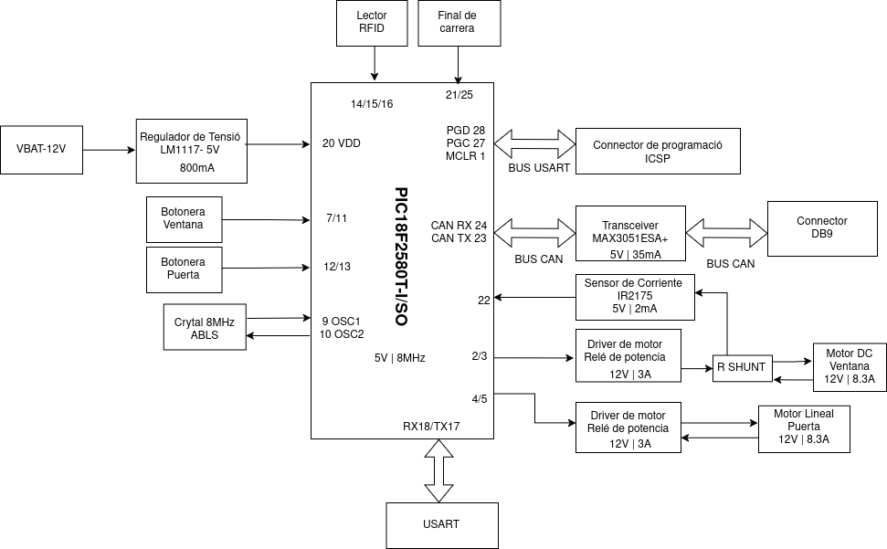

 # Disseny de les portes

> **Autors:** Brandon Ventura, Pablo Peñalba.

> **Grup Mati**                             

--------

## Objectivo

Diseño de una una PCB para controlar las puertas.

## Especificaciones

* Mecanismo de motor para el alza cristales con un final de carrera.

* Implementación de mecanismo de seguridad anti-atrapamiento para la ventana con sensor de corriente.

* Sistema con motor por apertura y cierre de la puerta.

* Incluir un módulo de lectura RFID para apertura sin llave.
## Diagrama de Bloques

## Components

| Descripció           | Referència         | Package | Datasheet                                                                                             | Proveedor                                                                                                                                                                                                                                             |
|:--------------------:|:------------------:|:--------:|:-----------------------------------------------------------------------------------------------------:|:-------------------------------------------------------------------------------------------------------------------------------------------------------------------------------------------------------------------------------------------------------------------------------------------:|
| Microcontrolador     | PIC18F2580T-I/SO   | SOIC-28  | [datasheet](https://www.mouser.sg/datasheet/2/268/39637d-3443674.pdf)                                 | [Mouser](https://www.mouser.sg/ProductDetail/Microchip-Technology/PIC18F2580T-I-SO?qs=5Wx0vN22rFK6FfhtZXWxdQ%3D%3D)                                                                                                                                              |
| Regulador de tensión | LM1117             | SOT-223  | [datasheet](https://www.mouser.es/datasheet/2/308/1/LM1117_D-2315022.pdf)                             | [Mouser](https://www.mouser.es/ProductDetail/onsemi/LM1117MPX-33NOPB?qs=DPoM0jnrROUIbzbQHFmeig%3D%3D)                                                                                                                                                                                       |
| Cristall 8 MHz       | ABM8AIG-8.000MHZ-1Z-T |          | [datasheet](https://www.mouser.es/datasheet/2/3/ABM8AIG-1775167.pdf)                                  | [Mouser](https://www.mouser.es/ProductDetail/ABRACON/ABM8AIG-8.000MHZ-1Z-T?qs=uwxL4vQweFM9%2FeRu4wQgCQ%3D%3D&srsltid=AfmBOoriDfBKSHWjOtEE_VRlSqB6bDJxLzhisTbPEm-Sjx0bfHumVILy)                                                                                                                                                                                  |
| Sensor de Corriente  | IR2175STRPBF       | SOIC-8   | [datasheet](https://www.mouser.es/datasheet/2/196/Infineon_IR2175_S__DataSheet_v01_00_EN-3362704.pdf) | [Mouser](https://www.mouser.es/ProductDetail/Infineon-Technologies/IR2175STRPBF?qs=2r01AXMCG3Mz96toc2YS0Q%3D%3D)                                                                                                                                              |
| Relé de potencia     | G6E                | ----     | [datasheet](https://docs.rs-online.com/8949/A700000008621017.pdf)                                       | [RS](https://es.rs-online.com/web/p/reles-de-potencia/0376593)                                                                                                                                                                                                                            |
| Transceiver          | MAX3051ESA+        | SOIC-8   | [datasheet](https://www.mouser.es/datasheet/2/609/MAX3051-3128607.pdf)                                | [Mouser](https://www.mouser.es/ProductDetail/Analog-Devices-Maxim-Integrated/MAX3051ESA%2BT?qs=CDqwynd4ZNpR5GfQHcjhqg%3D%3D)                                                                                                                                              |
| Conector DB9         | 2311765-2          | ---      | [datasheet](https://www.mouser.es/datasheet/2/418/7/ENG_CD_2311765_D-2072969.pdf)                     | [Mouser](https://www.mouser.es/ProductDetail/TE-Connectivity/2311765-2?qs=rrS6PyfT74frdzrH7SJRfg%3D%3D&mgh=1&vip=1&utm_id=19103542967&gad_source=1&gclid=CjwKCAjw26KxBhBDEiwAu6KXt0r6XHcXVAKDy0fb1AQDEcRaa8CqE_BUjWUK4OHCnLL84KZ4c8u68xoCDQcQAvD_BwE)|
| Buck Converter       | LM2596             | TO-263-5 | [datasheet](https://www.ti.com/lit/ds/symlink/lm2596.pdf) | [Mouser](https://www.mouser.es/ProductDetail/Texas-Instruments/LM2596SX-5.0-NOPB?qs=X1J7HmVL2ZGZ5T4VcWdmNw%3D%3D)                                                                                                                                                                                                                       |
| MOSFET P-Channel     | AO3401A            | SOT-23  | [datasheet](https://www.aosmd.com/sites/default/files/res/datasheets/AO3401A.pdf)                      | [Digikey](https://www.digikey.es/es/products/detail/alpha-omega-semiconductor-inc/AO3401A/1855773)                                                                                                                                                                                          |
| Transceiver CAN      | MAX3051ESA+        | SOIC-8  | [datasheet](https://www.mouser.es/datasheet/2/609/MAX3051-3469944.pdf)                                 | [Mouser](https://www.mouser.es/ProductDetail/Analog-Devices-Maxim-Integrated/MAX3051ESA%2bT?qs=sGAEpiMZZMuyKkoWRCJ2WCvAmU8rwmAFQagA9HhnCAw%3D)                                                                                                                            |
| Lector RFID          | DLP-RFID2          |         | [datasheet](https://www.mouser.es/datasheet/2/117/dlp-rfid2-ds-v114-1374531.pdf)                       | [Mouser](https://www.mouser.es/ProductDetail/DLP-Design/DLP-RFID2?qs=7edrXduW%2FNsZxdz8dNHO%252BQ%3D%3D)                                                                                                                                                                                    |

## Motores y final de carrera

| Motor DC         | Motor DC RS PRO                 | [datasheet](https://docs.rs-online.com/6e47/A700000007082069.pdf) | [Rs](https://es.rs-online.com/web/p/motores-dc/3213186)                       |
|:----------------:|:-------------------------------:|:-----------------------------------------------------------------:|:-----------------------------------------------------------------------------:|
| Motor Lineal     | Actuador lineal 12VDC 800N 2,9A |                                                                   | [Transmotec](https://www.transmotec.es/product/dla-12-30-a-50-ip65/?vat=true) |
| Final de carrera | Palanca de Rodillo RS PRO       | [datasheet](https://docs.rs-online.com/2b32/A700000008919438.pdf) | [Rs](https://es.rs-online.com/web/p/interruptores-final-de-carrera/9026871)   |

## Historial de cambios

| Data       | Autor     | Branch | Versión        | Descripción          |
| ---------- | --------- | ------ | -------------- | -------------------- |
| 26/03/2025 | B.Ventura | Main | initial commit | Readme y Esquemático |
| 26/03/2025 | B.Ventura | Main | | Diagrama de Bloques |
| 28/03/2025 | B.Ventura | Main | | Terminales y Diodos |
| 28/03/2025 | P.Penalba | Main | | Etiquetas,Botonera y Buck converter|
| 01/04/2025 | B.Ventura | Dev | | Corrección del esquema, terminal screw terminals y layout v1|
