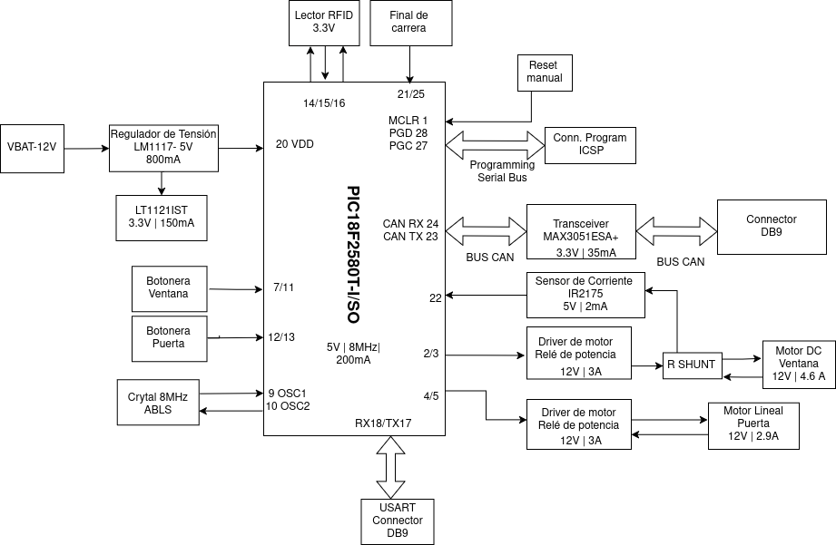

# Disseny de les portes

> **Autors:** Brandon Ventura, Pablo Peñalba.

> **Grup Mati**                             

--------

## Objectivo

Diseño de una una PCB para controlar las puertas.

## Especificaciones

* Mecanismo de motor para el alza cristales con un final de carrera.

* Implementación de mecanismo de seguridad anti-atrapamiento para la ventana con sensor de corriente.

* Sistema con motor por apertura y cierre de la puerta.

* Incluir un módulo de lectura RFID para apertura sin llave.
  
  ## Diagrama de Bloques
  
  
  
  ## Components

| Descripción               | Referencia          | Package   | Datasheet                                                                                                                                                                                                                                                                                                                                                                                                                                                                                  | Proveedor                                                                                                                                                                                                                                                                                                                                                                                                             | Precio/unidad | Cantidad |
|:-------------------------:|:-------------------:|:---------:|:------------------------------------------------------------------------------------------------------------------------------------------------------------------------------------------------------------------------------------------------------------------------------------------------------------------------------------------------------------------------------------------------------------------------------------------------------------------------------------------:|:---------------------------------------------------------------------------------------------------------------------------------------------------------------------------------------------------------------------------------------------------------------------------------------------------------------------------------------------------------------------------------------------------------------------:| ------------- | -------- |
| Microcontrolador          | PIC18F2580T-I/SO    | SOIC-28   | [datasheet](https://ww1.microchip.com/downloads/aemDocuments/documents/OTH/ProductDocuments/DataSheets/39637d.pdf)                                                                                                                                                                                                                                                                                                                                                                         | [DigiKey](https://www.digikey.es/es/products/detail/microchip-technology/PIC18F2580T-I-SO/739329?srsltid=AfmBOoqZu9kT-_KowIBzaAf4-_O7MsvTYlt4aUQzBQ2lc-jL20NezCRt)                                                                                                                                                                                                                                                    | 7,290 €       | 1        |
| Regulador de tensión-5V   | LM1117DT-5.0        | TO-252-3  | [datasheet](https://www.ti.com/lit/ds/symlink/lm1117.pdf?ts=1745298180828&ref_url=https%253A%252F%252Fwww.ti.com%252Fproduct%252FLM1117%253Futm_source%253Dgoogle%2526utm_medium%253Dcpc%2526utm_campaign%253Dapp-lp-null-44700045336317554_prodfolderdynamic-cpc-pf-google-eu_en_int%2526utm_content%253Dprodfolddynamic%2526ds_k%253DDYNAMIC+SEARCH+ADS%2526DCM%253Dyes%2526gclsrc%253Daw.ds%2526gad_source%253D1%2526gclid%253DEAIaIQobChMIy7u8je7qjAMVEbKDBx1GBzKxEAAYASAAEgJJMfD_BwE) | [Mouser](https://www.mouser.in/ProductDetail/Texas-Instruments/LM1117DT-5.0-NOPB?qs=X1J7HmVL2ZGITaQRKQ6NVA%3D%3D)                                                                                                                                                                                                                                                                                                     | 1,610 €       | 1        |
| Regulador de tensión 3,3V | LT1121IST-3.3       | SOT-223-3 | [datasheet](https://www.analog.com/media/en/technical-documentation/data-sheets/1121fg.pdf)                                                                                                                                                                                                                                                                                                                                                                                                | [DigiKey](https://www.digikey.at/en/products/detail/analog-devices-inc/LT1121IST-3-3-TRPBF/959066)                                                                                                                                                                                                                                                                                                                    | 8,190 €       | 1        |
| Cristal 8 MHz             | AA-8.000MALV-T      | SMD       | [datasheet](https://www.mouser.es/datasheet/2/417/aa_automotive-14929.pdf)                                                                                                                                                                                                                                                                                                                                                                                                                 | [Mouser](https://www.mouser.es/ProductDetail/TXC-Corporation/AA-8.000MALV-T?qs=02P6ycQEDWEs8mIQTVoxpQ%3D%3D)                                                                                                                                                                                                                                                                                                          | 0,779 €       | 1        |
| Pulsadores                | 3-1437565-0         | SMD       | [datasheet](https://www.mouser.es/datasheet/2/418/7/ENG_CD_2_1437565_7_V-2027970.pdf)                                                                                                                                                                                                                                                                                                                                                                                                      | [Mouser](https://www.mouser.es/ProductDetail/TE-Connectivity-PB/3-1437565-0?qs=%2FwXgF%2FfIho%2FDAgSy8ONeew%3D%3D)                                                                                                                                                                                                                                                                                                    | 0,266 €       | 5        |
| Transceiver               | MAX3051ESA+         | SOIC-8    | [datasheet](https://www.mouser.es/datasheet/2/609/MAX3051-3469944.pdf)                                                                                                                                                                                                                                                                                                                                                                                                                     | [Mouser](https://www.mouser.es/ProductDetail/Analog-Devices-Maxim-Integrated/MAX3051ESA+?qs=CDqwynd4ZNpXRaQ90S7BzQ%3D%3D)                                                                                                                                                                                                                                                                                             | 3,820 €       | 1        |
| Módulo RFID               | DLP-RFID2           | THT       | [datasheet](https://www.mouser.es/datasheet/2/117/dlp-rfid2-ds-v114-1374531.pdf)                                                                                                                                                                                                                                                                                                                                                                                                           | [Mouser](https://www.mouser.es/ProductDetail/DLP-Design/DLP-RFID2?qs=7edrXduW%2FNsZxdz8dNHO%2BQ%3D%3D)                                                                                                                                                                                                                                                                                                                | 36,050 €      | 1        |
| Conector coaxial          | Conector coaxial RS | THT       | [datasheet](https://docs.rs-online.com/062e/A700000007510792.pdf)                                                                                                                                                                                                                                                                                                                                                                                                                          | [RS](https://es.rs-online.com/web/p/conectores-coaxiales/5464049)                                                                                                                                                                                                                                                                                                                                                     | 9,630 €       | 1        |
| Sensor de Corriente       | IR2175STRPBF        | SOIC-8    | [datasheet](https://www.mouser.es/datasheet/2/196/Infineon_IR2175_S__DataSheet_v01_00_EN-3362704.pdf)                                                                                                                                                                                                                                                                                                                                                                                      | [Mouser](https://www.mouser.es/ProductDetail/Infineon-Technologies/IR2175STRPBF?qs=2r01AXMCG3Mz96toc2YS0Q%3D%3D)                                                                                                                                                                                                                                                                                                      | 3,080 €       | 1        |
| Relé de potencia          | G6E                 | THT       | [datasheet](https://docs.rs-online.com/8949/A700000008621017.pdf)                                                                                                                                                                                                                                                                                                                                                                                                                          | [RS](https://es.rs-online.com/web/p/reles-de-potencia/0376593)                                                                                                                                                                                                                                                                                                                                                        | 6,180 €       | 4        |
| Conector DB9              | 2311765-2           | THT       | [datasheet](https://www.mouser.es/datasheet/2/418/7/ENG_CD_2311765_D-2072969.pdf)                                                                                                                                                                                                                                                                                                                                                                                                          | [Mouser](https://www.mouser.es/ProductDetail/TE-Connectivity/2311765-2?qs=rrS6PyfT74frdzrH7SJRfg%3D%3D&mgh=1&vip=1&utm_id=19103542967&gad_source=1&gclid=CjwKCAjw26KxBhBDEiwAu6KXt0r6XHcXVAKDy0fb1AQDEcRaa8CqE_BUjWUK4OHCnLL84KZ4c8u68xoCDQcQAvD_BwE)                                                                                                                                                                 | 2,760 €       | 2        |
| MOSFET P-Channel          | AO3401A             | SOT-23-3  | [datasheet](https://www.aosmd.com/sites/default/files/res/datasheets/AO3401A.pdf)                                                                                                                                                                                                                                                                                                                                                                                                          | [Digikey](https://www.digikey.es/es/products/detail/alpha-omega-semiconductor-inc/AO3401A/1855773)                                                                                                                                                                                                                                                                                                                    | 0,420 €       | 4        |
| Led verde                 | LTST-C150KGKT       | 1206      | [datasheet](https://www.mouser.es/datasheet/2/239/LTST_C150KGKT-1143771.pdf)                                                                                                                                                                                                                                                                                                                                                                                                               | [Mouser](https://www.mouser.es/ProductDetail/LITEON/LTST-C150KGKT?qs=G7lFeYdtIHB%2FzaFKBwEyXw%3D%3D)                                                                                                                                                                                                                                                                                                                  | 0,171 €       | 1        |
| Pin Header 1x3            | 61300311121         | THT       | [datasheet](https://www.we-online.com/components/products/datasheet/61300311121.pdf)                                                                                                                                                                                                                                                                                                                                                                                                       | [DigiKey](https://www.digikey.es/es/products/detail/w%C3%BCrth-elektronik/61300311121/4846825?utm_adgroup=&utm_source=google&utm_medium=cpc&utm_campaign=PMax_Supplier_W%C3%BCrth%20Elektronik&utm_term=&utm_content=&utm_id=go_cmp-20673490314_adg-_ad-__dev-c_ext-_prd-4846825_sig-CjwKCAjw26KxBhBDEiwAu6KXt-nrzPnR6AizAc4OFYg5FhEvs2IVS_BrHZ7kmUmR4I-WiUOawUIyVxoCUwUQAvD_BwE&gad_source=1)                        | 0,110 €       | 1        |
| Pin Header 1x5            | 61300511121         | THT       | [datasheet](https://www.we-online.com/components/products/datasheet/61300511121.pdf)                                                                                                                                                                                                                                                                                                                                                                                                       | [DigiKey](https://www.digikey.es/es/products/detail/w-rth-elektronik/61300511121/4846831?gclsrc=aw.ds&&utm_adgroup=&utm_source=google&utm_medium=cpc&utm_campaign=PMax_Supplier_W%C3%BCrth%20Elektronik&utm_term=&utm_content=&utm_id=go_cmp-20673490314_adg-_ad-__dev-c_ext-_prd-4846831_sig-Cj0KCQjw_JzABhC2ARIsAPe3ynqs6H_uQKrXoszVjdwNbumXRq61QB8zz5D_9xSB8SHJlS3C75W4jUcaAgxDEALw_wcB&gad_source=1&gclsrc=aw.ds) | 0,220 €       | 3        |
| Connector screw 1x2       | 1729128             | ---       | [datasheet](https://www.phoenixcontact.com/en-us/products/printed-circuit-board-terminal-mkdsn-15-2-508-1729128?type=pdf)                                                                                                                                                                                                                                                                                                                                                                  | [Mouser](https://www.mouser.es/ProductDetail/Phoenix-Contact/1729128?qs=GFUSqQMLmmnCBVBY3dts9w%3D%3D&mgh=1&vip=1&utm_id=19103542967&gad_source=1)                                                                                                                                                                                                                                                                     | 1,020 €       | 3        |
| Connector screw 1x3       | 1751251             | ---       | [datasheet](https://www.phoenixcontact.com/en-us/products/printed-circuit-board-terminal-mkds-1-3-35-1751251?type=pdf)                                                                                                                                                                                                                                                                                                                                                                     | [Mouser](https://www.mouser.es/ProductDetail/Phoenix-Contact/1751251?qs=wdlOgCqRo4w4Go2awGHrzA%3D%3D&mgh=1&vip=1&utm_id=19103542967&utm_source=google&utm_medium=cpc&utm_marketing_tactic=emeacorp&gad_source=1&gclid=CjwKCAjwn6LABhBSEiwAsNJrjgZZoCVfRYw56vXbadD5RguB0HYuv-8IHCZePBymYZpktI2TEDrjRBoCaIAQAvD_BwE)                                                                                                    | 1,680 €       | 2        |
| Resistencias 10K          | RK73G2BTTD1002F     | 1206      | [datasheet](https://www.koaspeer.com/pdfs/RK73G.pdf)                                                                                                                                                                                                                                                                                                                                                                                                                                       | [Mouser](https://www.mouser.es/ProductDetail/KOA-Speer/RK73G2BTTD1002F?qs=sGAEpiMZZMtlubZbdhIBIDot9%252BiNsVp%2FQ8bvR3gz9R8%3D)                                                                                                                                                                                                                                                                                       | 0,241 €       | 15       |
| Resistencia 60            | RP73PF1J60R4BTDF    | 0603      | [datasheet](https://www.mouser.es/datasheet/2/418/10/ENG_DS_1773272_M1-1588495.pdf)                                                                                                                                                                                                                                                                                                                                                                                                        | [Mouser](https://www.mouser.es/ProductDetail/TE-Connectivity-Holsworthy/RP73PF1J60R4BTDF?qs=gt1LBUVyoHkLKYO0jJjvhA%3D%3D)                                                                                                                                                                                                                                                                                             | 0,456 €       | 1        |
| Resistencia 1K            | RNCA0603BTE1K00     | 0603      | [datasheet](https://www.mouser.es/datasheet/2/385/SEI_RNCA-3473065.pdf)                                                                                                                                                                                                                                                                                                                                                                                                                    | [Mouser](https://www.mouser.es/ProductDetail/SEI-Stackpole/RNCA0603BTE1K00?qs=i8QVZAFTkqR0RAUMHohaTQ%3D%3D)                                                                                                                                                                                                                                                                                                           | 0,228 €       | 1        |
| Resistencia shunt         | WSHM2818R1000FEA    | SMD       | [datasheet](https://www.vishay.com/docs/30188/wshm2818.pdf)                                                                                                                                                                                                                                                                                                                                                                                                                                | [Mouser](https://www.mouser.es/ProductDetail/Vishay-Dale/WSHM2818R1000FEA?qs=sGAEpiMZZMtlleCFQhR%2FzR2tSEfVSrFZ5FX0iCqyh4mr%252BZVUTZXBeA%3D%3D)                                                                                                                                                                                                                                                                      | 1,370 €       | 1        |
| 10u                       | ECA-1CHG101I        | THT       | [datasheet](https://industrial.panasonic.com/cdbs/www-data/pdf/RDF0000/ABA0000C1218.pdf)                                                                                                                                                                                                                                                                                                                                                                                                   | [Mouser](https://www.mouser.es/ProductDetail/Panasonic/ECA-1CM100I?qs=fcM5arftASvKR70PPIzFqA%3D%3D)                                                                                                                                                                                                                                                                                                                   | 0,152 €       | 3        |
| 1u                        | C0805C105K4RACAUTO  | 0805      | [datasheet](https://www.mouser.es/datasheet/2/447/KEM_C1023_X7R_AUTO_SMD-3316698.pdf)                                                                                                                                                                                                                                                                                                                                                                                                      | [Mouser](https://www.mouser.es/ProductDetail/KEMET/C0805C105K4RACAUTO?qs=OHu5RF0w3QprP0D5VzlqaQ%3D%3D)                                                                                                                                                                                                                                                                                                                | 0,152 €       | 1        |
| 100n                      | C1206C104K4RACTU    | 1206      | [datasheet](https://www.mouser.es/datasheet/2/447/KEM_C1002_X7R_SMD-3316098.pdf)                                                                                                                                                                                                                                                                                                                                                                                                           | [Mouser](https://www.mouser.es/ProductDetail/KEMET/C1206C104K4RACTU?qs=NAOyRStS94fKvqJx0gg6JQ%3D%3D)                                                                                                                                                                                                                                                                                                                  | 0,095 €       | 7        |
| 21p                       | 0504N220J500P       | 0504      | [datasheet](https://www.knowlescapacitors.com/getattachment/ddd08fe0-16c1-4f86-944e-edc3fc04fb57/X7R.aspx)                                                                                                                                                                                                                                                                                                                                                                                 | [DigiKey](https://www.digikey.es/es/products/detail/knowles-novacap/0504N220J500P/21849946?s=N4IgjCBcpgbFoDGUBmBDANgZwKYBoQB7KAbRAGYBOAJjAHYQBdAgBwBcoQBlNgJwEsAdgHMQAXwLUADABZKCEMkjps%2BIqRDVqAAhYAxJqw6QQAVUH82AeRQBZHGiwBXXjnETNGxGhZpElwl5tLABbABMmMSA)                                                                                                                                                          | 0,620 €       | 2        |
| D6,D7,D8,D9               | SR1202 A0G          | THT       | [datasheet](https://services.taiwansemi.com/storage/resources/datasheet/SR1202%20SERIES_G2105.pdf)                                                                                                                                                                                                                                                                                                                                                                                         | [Mouser](https://www.mouser.es/ProductDetail/Taiwan-Semiconductor/SR1202-A0G?qs=mAH9sUMRCtsYw%2FEG19A30A%3D%3D)                                                                                                                                                                                                                                                                                                       | 0,384 €       | 4        |
| D4,D5                     | SBR12A45SD1-T       | THT       | [datasheet](https://www.diodes.com/assets/Datasheets/SBR12A45SD1.pdf)                                                                                                                                                                                                                                                                                                                                                                                                                      | [Mouser](https://www.mouser.es/ProductDetail/Diodes-Incorporated/SBR12A45SD1-T?qs=oUsD4qhOtFxVeI%252BTfVYIRA%3D%3D)                                                                                                                                                                                                                                                                                                   | 0,485 €       | 2        |
| D2                        | SR1203H             | THT       | [datasheet](https://services.taiwansemi.com/storage/resources/datasheet/SR1202%20SERIES_G2105.pdf)                                                                                                                                                                                                                                                                                                                                                                                         | [Mouser](https://www.mouser.es/ProductDetail/Taiwan-Semiconductor/SR1203H?qs=sGAEpiMZZMvplms98TlKY%2FeyDi3uMxFUBy2aTn9D5Xra285XE8SMsA%3D%3D)                                                                                                                                                                                                                                                                          | 0,384 €       | 1        |
| D3                        | SBR10U45SD1-T       | THT       | [datasheet](https://www.diodes.com/assets/Datasheets/SBR10U45SD1.pdf)                                                                                                                                                                                                                                                                                                                                                                                                                      | [Mouser](https://www.mouser.es/ProductDetail/Diodes-Incorporated/SBR10U45SD1-T?qs=oUsD4qhOtFyWKufSWj8qkg%3D%3D)                                                                                                                                                                                                                                                                                                       | 0,912 €       | 1        |

##Motores y final de carrera

| Descripción      | Referencia                      | Datasheet                                                         | Proveedor                                                                     | Cantidad |
|:----------------:|:-------------------------------:|:-----------------------------------------------------------------:|:-----------------------------------------------------------------------------:| -------- |
| Motor Lineal     | Actuador lineal 12VDC 800N 2,9A |                                                                   | [Transmotec](https://www.transmotec.es/product/dla-12-30-a-50-ip65/?vat=true) | 1        |
| Motor DC         | Motor DC RS PRO                 | [datasheet](https://docs.rs-online.com/6e47/A700000007082069.pdf) | [Rs](https://es.rs-online.com/web/p/motores-dc/3213186)                       | 1        |
| Final de carrera | Palanca de Rodillo RS PRO       | [datasheet](https://docs.rs-online.com/2b32/A700000008919438.pdf) | [Rs](https://es.rs-online.com/web/p/interruptores-final-de-carrera/9026871)   | 2        |

## Historial de cambios

| Data       | Autor               | Branch | Descripción                                                                             |
| ---------- | ------------------- | ------ | --------------------------------------------------------------------------------------- |
| 26/03/2025 | B.Ventura           | Main   | Readme y Esquemático                                                                    |
| 26/03/2025 | B.Ventura           | Main   | Diagrama de Bloques                                                                     |
| 28/03/2025 | B.Ventura           | Main   | Terminales y Diodos                                                                     |
| 28/03/2025 | P.Peñalba           | Main   | Etiquetas,Botonera y Buck converter                                                     |
| 01/04/2025 | B.Ventura           | Main   | Corrección del esquema, terminal screw terminals y layout v1                            |
| 09/04/2025 | B.Ventura           | Main   | cambio de posición pines, cambio de terminales final de carrera y corrección error grid |
| 09/04/2025 | B.Ventura/P.Peñalba | Main   | layout versión 2, reglas de diseño JLCPCB                                               |
| 12/04/2025 | B.Ventura/P.Peñalba | Main   | Corrección de las pistas layout y planos                                                |
| 21/04/2025 | B.Ventura           | Main   | Presupuesto                                                                             |
